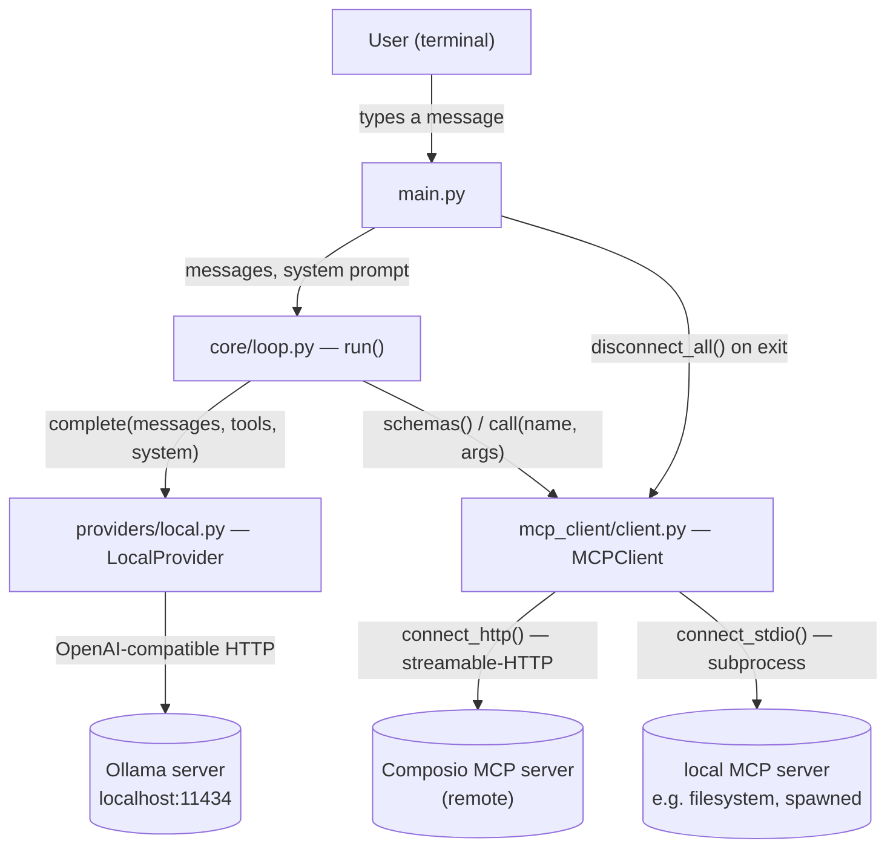
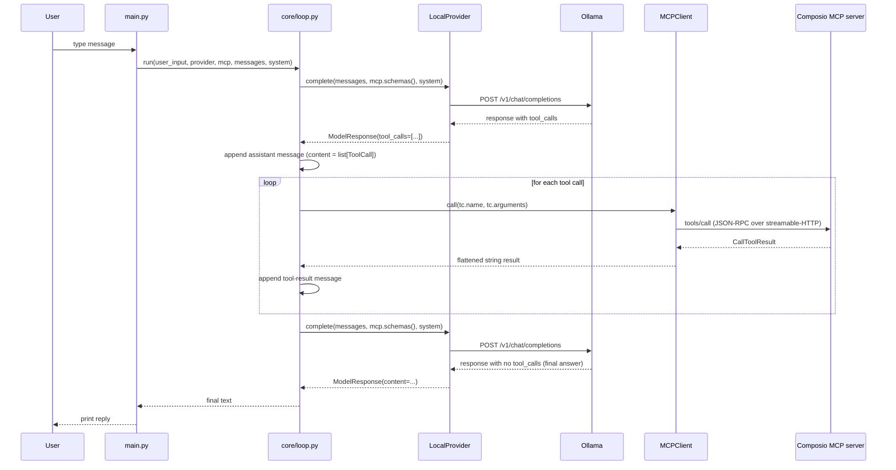
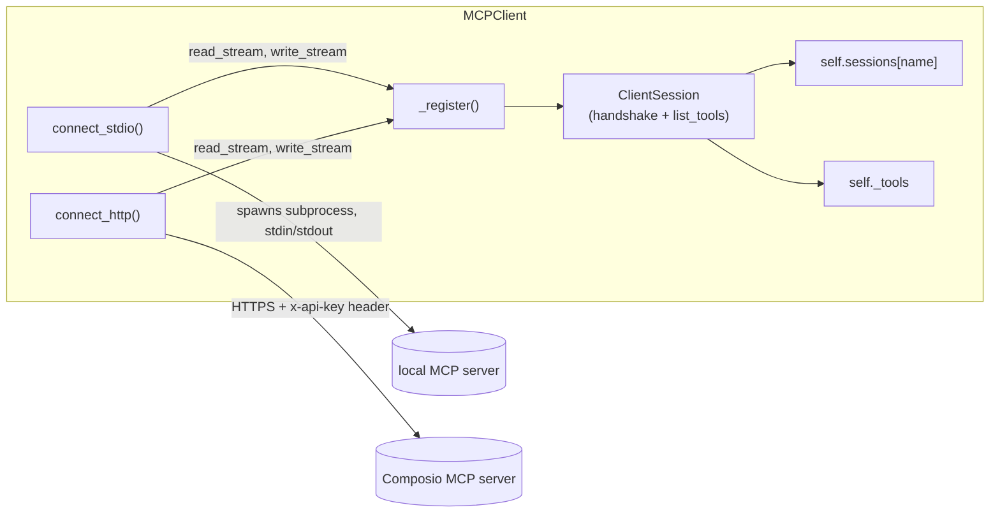
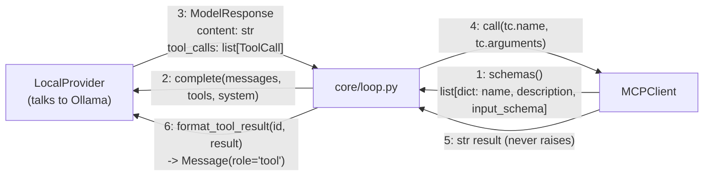

# agent-harness

A hand-rolled agent harness, built against a local Ollama model, using MCP
(Model Context Protocol) as its tool layer. Started as an intentional
scaffold (signatures and comments, no implementations) — the core pieces
(`core/loop.py`, `main.py`, `providers/local.py`, `mcp_client/client.py`)
are now real, working code, verified against a live Composio MCP server.
See `research/learning_agent_architecture.md` for the design concepts
behind this, and `docs/ISSUES.md` for the current, up-to-date status of
what's built vs. still open.

## Setup

### 1. Base setup — Ollama + Python deps

```bash
# 1. install Ollama: https://ollama.com/download
# 2. pull a tool-calling-capable model
ollama pull qwen3:14b        # this project's coded default (providers/local.py)
# or: ollama pull llama3.1   # smaller/faster alternative — set AGENT_MODEL=llama3.1 in .env if you use this

# 3. start the Ollama server (if not already running)
ollama serve

# 4. confirm the model actually supports tool calls before relying on it —
#    claiming support and reliably returning tool calls are not the same thing
ollama show qwen3:14b        # look for "tools" under Capabilities

# 5. python deps (uv manages the venv for you)
uv sync
```

Run scripts with `uv run python main.py` (no manual venv activation
needed). To add a dependency later: `uv add <package>`.

### 2. Connecting to an MCP server (e.g. Composio)

Tool servers are connected entirely via environment variables read from a
local `.env` file (loaded with `python-dotenv` — never commit this file;
it's in `.gitignore`). Without it, `main.py` still runs — just with zero
tools available, as a plain chat.

```bash
# .env
COMPOSIO_API_KEY=ak_...
COMPOSIO_MCP_URL=https://backend.composio.dev/tool_router/{session_id}/mcp
AGENT_MODEL=qwen3:14b        # optional — only needed to override the default
```

**Getting `COMPOSIO_MCP_URL`:** Composio's dashboard has no "create
session" button — its Sessions page literally says *"Start using the SDK
to see sessions here."* A session (and the MCP URL that comes with it)
only exists once created in code:

```python
# one-off script — not part of this repo, throwaway
# run with: uv run --with composio python get_composio_mcp_url.py
import os
from composio import Composio

composio = Composio(api_key=os.environ["COMPOSIO_API_KEY"])
session = composio.create(user_id="pick-any-stable-id")
print(session.mcp.url)       # -> COMPOSIO_MCP_URL
print(session.mcp.headers)   # -> should be {"x-api-key": "<your key>"}, matching main.py's connect_http() call
```

Run that once, copy the printed URL into `.env`, done — the `composio`
package itself is *not* a dependency of `agent-harness` (this project
talks to Composio over plain MCP, not Composio's own SDK; see
`docs/ISSUES.md`'s note on the two different integration paths).

### 3. Run it

```bash
uv run python main.py
```

```
Connecting to Composio MCP server...
Connected — 6 tool(s) available.

Type a message ('exit' to quit, Ctrl+C to interrupt).

>
```

## Dependencies

From `pyproject.toml` (managed by `uv`, Python `>=3.11` pinned in
`.python-version`):

| Package | What it's for |
|---|---|
| `mcp` | The MCP client SDK — `ClientSession`, `stdio_client`, `streamable_http_client`. Powers `mcp_client/client.py`. |
| `openai` | The OpenAI Python SDK, pointed at Ollama's OpenAI-compatible endpoint instead of OpenAI's own. Powers `providers/local.py`. |
| `python-dotenv` | Loads `.env` so `COMPOSIO_API_KEY`/`COMPOSIO_MCP_URL` don't need exporting every shell session. |
| `typing-extensions` | Backport for `typing.override`, which doesn't exist until Python 3.12 — this project pins 3.11. |

External, not `pip`/`uv` installable:

- **Ollama**, running locally (`ollama serve`) with a tool-calling model
  pulled — this project's actual intelligence.
- **A Composio account + API key**, if you want real tools rather than a
  plain no-tools chat — see Setup step 2.

## Architecture — how the pieces fit together

### Component overview



`core/loop.py` is the only thing that talks to both `LocalProvider` and
`MCPClient` — neither of them knows the other exists. That's deliberate:
swap Ollama for a different provider, or Composio for a different MCP
server, and the loop itself never changes.

### One full turn, including a tool call



Against a real Composio session, the first tool call is very often
`COMPOSIO_SEARCH_TOOLS` (Composio exposes a small meta-tool router rather
than one tool per app action — see `docs/ISSUES.md` for the full list and
why), so a real turn usually loops through the "for each tool call" block
more than once before reaching a final answer.

### `MCPClient`'s transport abstraction



Both transports produce the same two-stream shape before handing off to
`_register()` — that shared method is the only place the session
handshake and tool-list bookkeeping live, regardless of which transport
built the streams. Adding a third transport (SSE, websocket) later is one
more thin `connect_*()` wrapper, not a change to `_register()`. Full
walkthrough: `docs/Understanding/mcp_stream_lifetime_bug.md` and
`docs/Understanding/jsonrpc_and_mcp_protocol.md`.

### How the loop ties the LLM and MCPClient together

The most important thing to understand about this architecture: **the LLM
(via `LocalProvider`) and `MCPClient` never interact with each other.**
Neither one holds a reference to the other, and neither knows the other
exists. `core/loop.py` is the only thing that talks to both — it's a
courier carrying small, fixed data shapes back and forth, not an
intelligent component itself. All the "thinking" happens inside one
isolated, stateless call to the model; the loop just decides when to make
that call and what to do with what comes back.



Steps 1-3 happen once per turn before anything is decided; steps 4-6 only
happen if the model actually requested a tool call in step 3. Then the
loop goes back to step 1 with the updated `messages`.

**What `ModelResponse` is, and why it depends on OpenAI's shape.**
`providers/base.py` defines it as a plain dataclass:

```python
@dataclass
class ModelResponse:
    content: str                  # text reply (empty if only tool calls)
    tool_calls: list[ToolCall]    # tools the model wants to run this turn
    stop_reason: str              # e.g. "stop" vs "tool_calls"
    usage: dict[str, object]      # token counts
```

This dataclass itself is provider-agnostic — `core/loop.py` only ever
touches these four fields, never raw API JSON. But *populating* it is
entirely `providers/local.py`'s job, and that step is unavoidably
OpenAI-shaped: Ollama exposes an OpenAI-compatible `/v1/chat/completions`
endpoint, so `complete()` sends the request in OpenAI's wire format and
receives `response.choices[0].message` back in OpenAI's format too —
`finish_reason`, `tool_calls[i].function.name`,
`tool_calls[i].function.arguments` (a **JSON-encoded string**, not a
dict). `providers/local.py` unpacks that raw shape into `ModelResponse`
before the loop ever sees it. Swap Ollama for a different
OpenAI-compatible provider and nothing changes; swap in a provider with a
genuinely different API shape (e.g. Anthropic's Messages API) and only
`providers/local.py`'s parsing logic would need to change — `ModelResponse`
itself stays identical, which is the entire point of the abstraction.

**What a tool call looks like, and why it's shaped that way.**

```python
@dataclass
class ToolCall:
    id: str                      # unique per call
    name: str                    # which tool to run
    arguments: dict[str, object] # already-parsed, not a JSON string
```

Three fields, each earning its place: `id` exists purely for
correlation — a single turn can request multiple tool calls at once, and
results can come back in any order, so `tool_call_id` on the later
`Message(role="tool", ...)` has to reference this exact `id` to say which
request it's answering. `name` and `arguments` are just "what to call and
with what" — deliberately nothing else. `arguments` is a `dict`, not the
raw JSON string Ollama actually sends — `providers/local.py` does
`json.loads(tc.function.arguments)` before this dataclass is ever
constructed, so nothing downstream (the loop, `MCPClient`) ever has to
think about JSON parsing.

**What `mcp.schemas()` looks like, and what reaches `core/loop.py`.**
`MCPClient.schemas()` returns a plain list of dicts:

```python
[
    {
        "name": "COMPOSIO_SEARCH_TOOLS",
        "description": "...",
        "input_schema": { ... },   # JSON Schema, straight from the MCP server
    },
    ...
]
```

This is the exact shape `core/loop.py` passes to `provider.complete(...)`
as `tools=mcp.schemas()` — the loop never transforms it further. That
transformation happens one layer downstream, inside
`providers/local.py`'s `_format_tools()`, which is also where
`input_schema` (MCP/Anthropic's naming convention) becomes `parameters`
(OpenAI's naming convention) — see `_format_tools()`'s own docstring. The
loop itself stays agnostic to both namings; it just relays whatever
`MCPClient` currently reports as available, fresh, every single turn —
which is also why a server that connects mid-conversation or whose tool
list changes would be picked up automatically without any code change.


Real, working code:

- **`main.py`** — entry point. Loads `.env`, connects to whatever MCP
  servers are configured via env vars (currently just Composio), runs a
  terminal chat loop calling `core.loop.run()` per message, and always
  disconnects cleanly on exit (normal, `exit`, or Ctrl+C).
- **`core/loop.py`** — the ReAct loop itself: send history + tool schemas
  to the model, dispatch any requested tool calls through MCP, append
  results, repeat until the model returns plain text or `max_turns` is
  hit. Grounded against LangGraph's own `react-agent` reference
  implementation and `marcosf63/react-agent-framework`'s docs, not
  written from memory — see the file's own docstring for specifics.
- **`providers/base.py`** — the provider-agnostic shapes every provider
  translates into: `Message`, `ToolCall`, `ModelResponse`, and the
  `BaseProvider` ABC (`complete()`, `stream()`, `format_tool_result()`).
  The loop only ever touches these three dataclasses, never a raw API
  response.
- **`providers/local.py`** — the concrete `BaseProvider` for Ollama.
  Translates `Message`/`ToolCall` to and from Ollama's OpenAI-compatible
  wire format in both directions — the one file allowed to know what that
  raw JSON looks like.
- **`mcp_client/client.py`** — `MCPClient`: connects to MCP servers (local
  subprocess via `connect_stdio()`, remote over streamable-HTTP via
  `connect_http()`), fetches their tool schemas (`schemas()`), and
  dispatches calls to whichever connected server owns a given tool
  (`call()`). Named `mcp_client/` rather than `mcp/` specifically to avoid
  colliding with the installed `mcp` PyPI package.

Still stubs — signatures and TODOs, not implementations, and not needed
for the current MCP-only path (see `docs/ISSUES.md`'s closing note):

- **`tool.py`** — the `Tool` dataclass for *in-process* Python tools
  (name/description/JSON-Schema/callable). `core/loop.py` was built to
  dispatch entirely through `MCPClient` instead, so this isn't wired in
  anywhere yet.
- **`tools/example_tools.py`** — `read_file`/`run_shell_command` as
  example in-process tools, meant to pair with `tool.py` above.
- **`archive/agent.py`** — an earlier, simpler `Agent` class sketch that
  predates `providers/local.py` and `mcp_client/client.py` (uses a
  synchronous `OpenAI` client directly, no `BaseProvider`/`MCPClient` at
  all). Superseded by `core/loop.py`; kept around as a reference for the
  original minimal design, not imported from anywhere.

## Current status / what's left

See `docs/ISSUES.md` for the live, itemized checklist — as of the last
update: MCP transport, env/secret handling, the loop, and `main.py` are
all done and verified against a real Composio session (6 tools listed
live). The one open item is confirming the pulled Ollama model actually
supports tool calls and running a full tool-calling turn end-to-end.
